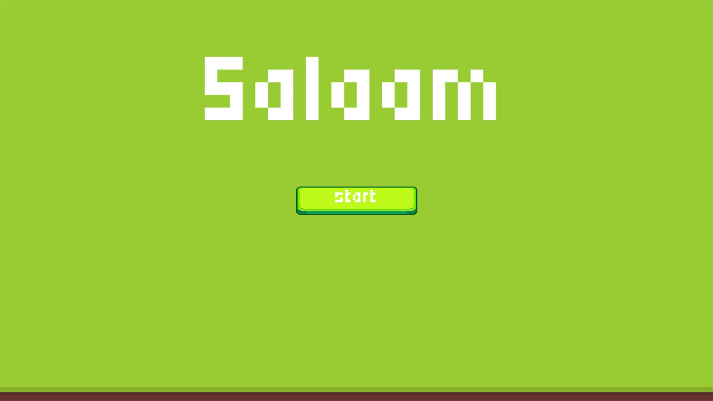
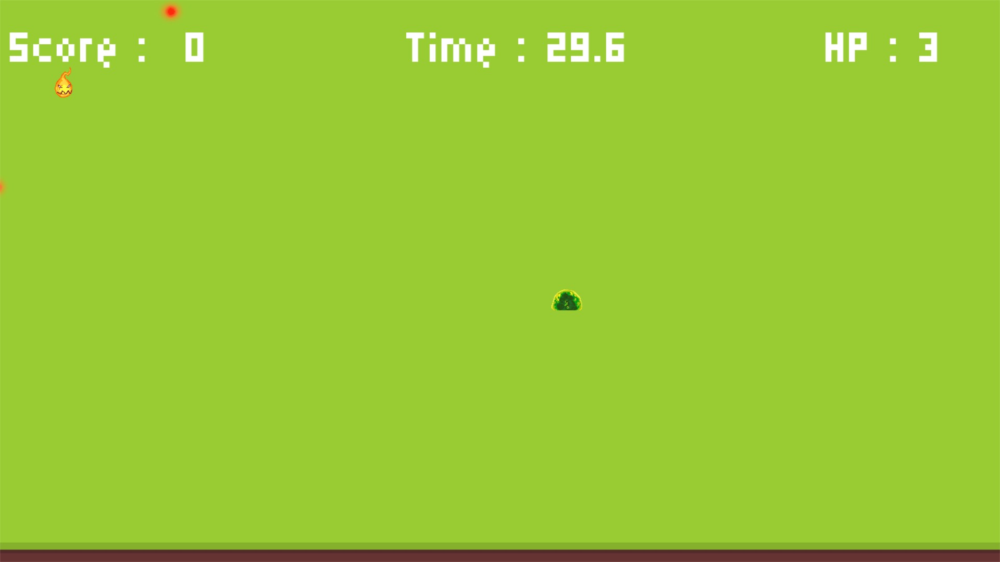

# Project Salaam

สำหรับวิฃา .[OOP](https://wichit2s.github.io)

เว็บไซต์ .[Salaam](https://github.com/xoKIMox/oop-project.github.io)

# application title: **Salaam**

# author: 

  * id: 66114540850
  * name: นาย อภิวัฒน์ คันทะพรม
  * id: 66114540575
  * name: นางสาว มณฑกานต์ ศรีลาอาจ

# technology: [ pygame ]

# application description:
เกิดเป็นสไลม์ที่อยู่ในโลกสีเขียวที่ว่างเปล่า รู้เพียงอย่างเดียวเท่านั้น คือต้องเอาตัวรอด พลังที่เหลืออยู่กำลังลดลงอย่างรวดเร็ว มีแต่ต้องตามเก็บลูกไฟเพื่อยื่อให้มีชีวิตรอด และพยามยามเอาชีวิตรอดจากลูกบอลแดงมรณะที่จะพร้อมวิ่งเข้ามาทำร้ายคุณจากทุกทิศทางได้ตลอดเวลา เอาตัวรอดจากลูกบอลแดง เพื่อมีชีวิตรอดให้นานที่สุดในโลกที่ว่างเปล่า
## วิธีการใช้งาน โปรแกม

- ซิงค์ตัวโปรเจกเข้ากับ ตัวรันโปรแกรม
  
- pip install pygame
  
- กดรันได้เลย
  
* presentation: .[Salaam](https://www.canva.com/design/DAF9-KZwWJo/f4CRZLaA0hgyuB8vEMfV2A/edit?utm_content=DAF9-KZwWJo&utm_campaign=designshare&utm_medium=link2&utm_source=sharebutton)
* video: link .[Present](https://youtu.be/TC8M8TTkHAo?si=UVGFzo7Yw_xhbfUS)
